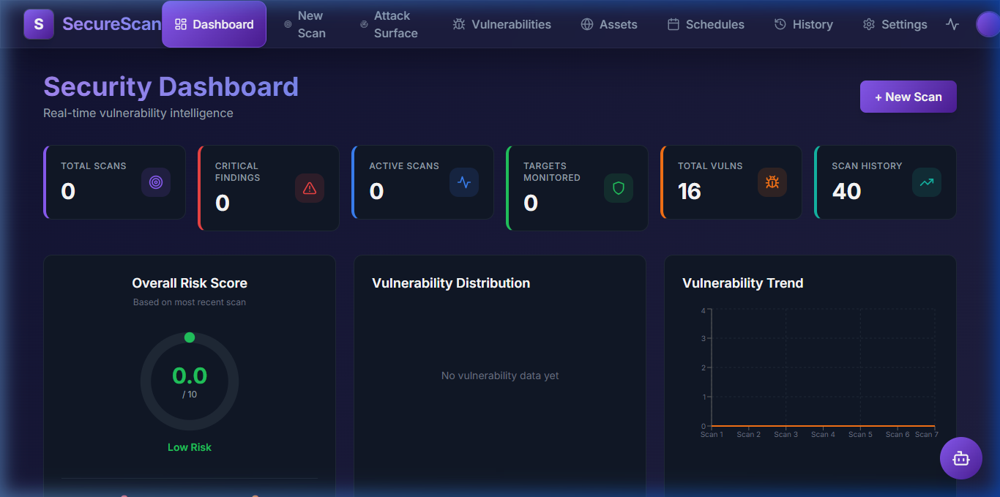
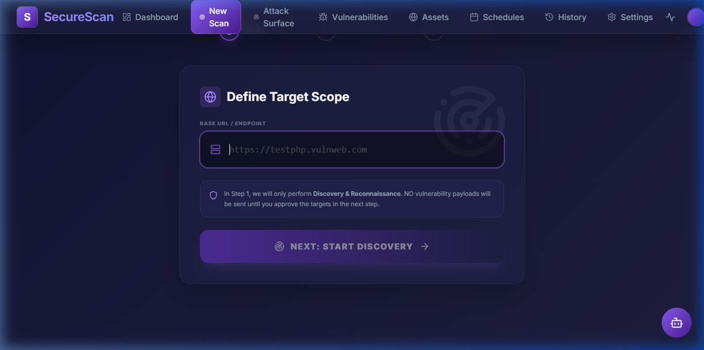
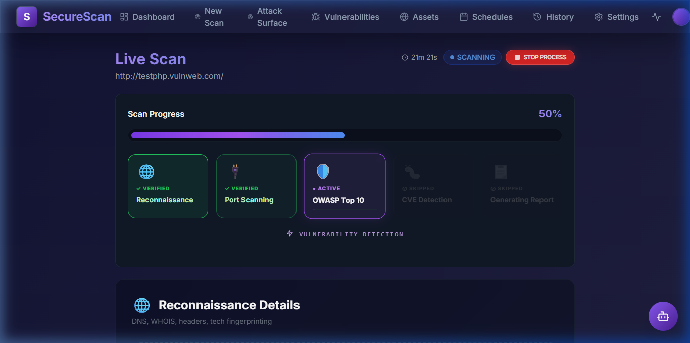
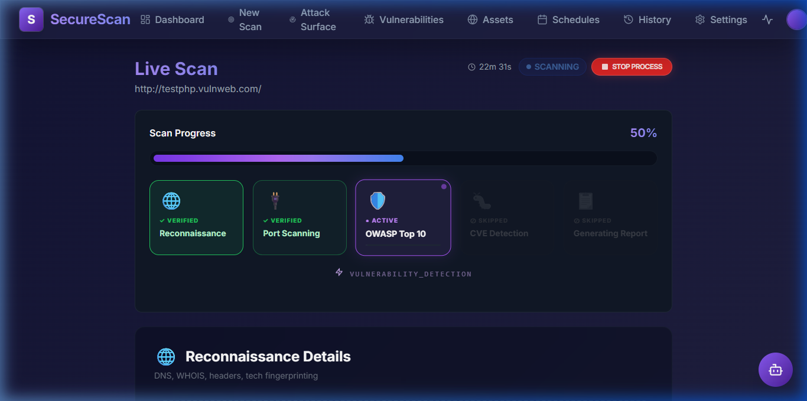
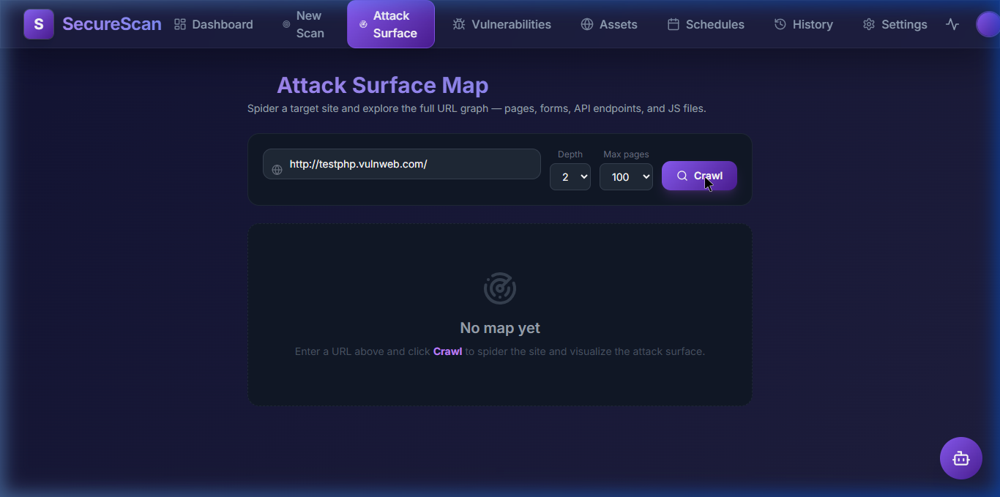
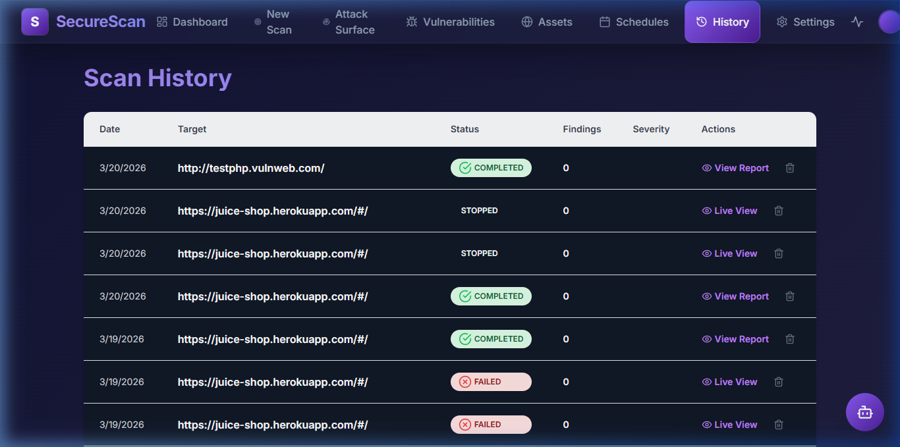

# School of Technology
## Final Year Project II

# SecureScan - User Training Manual
*A comprehensive guide to effectively using the SecureScan Vulnerability Scanner.*

**Copyright © 2026 The SecureScan Team.**  
All rights reserved. No part of this publication may be reproduced, distributed, or transmitted in any form without the prior written permission of the publisher.

### Disclaimer
*The SecureScan software is provided "as is", without warranty of any kind. This tool is designed for authorized educational and professional security testing only. Users must possess explicit, written permission from the target system owner before performing any security analysis. Unauthorized access to computer systems is illegal and unethical. The developers of SecureScan do not condone or support any form of cyber-attack or malicious activity. Use this tool responsibly and strictly for defensive security research and educational purposes.*

## Preface 
Welcome to the SecureScan User Training Manual. This guide is designed to help non-technical users, IT Administrators, and Security Professionals understand and operate the SecureScan web application efficiently. Whether you are running your first vulnerability scan or analyzing a complex attack surface graph, this guide will walk you through each procedural step.

**How to use this guide:**
- Use the **Table of Contents** to navigate to specific procedures.
- Terms in *italics* are defined in the Glossary at the back of this manual.
- Screenshots are provided for visual reference during key tasks.

## Table of Contents
1. [Introduction](#1-introduction)
2. [Getting Started](#2-getting-started)
3. [Procedures & How-To's](#3-procedures--how-tos)
   - [How to Start a New Scan](#how-to-start-a-new-scan)
   - [How to View Scan Progress (Live Scan)](#how-to-view-scan-progress)
   - [How to Explore the Attack Surface Map](#how-to-explore-the-attack-surface-map)
   - [How to View Scan History](#how-to-view-scan-history)
4. [Advanced Features](#4-advanced-features)
   - [AI Assistant Integration](#ai-assistant-integration)
   - [Custom Payload System](#custom-payload-system)
   - [CVE Database & Service Detection](#cve-database--service-detection)
5. [Reference Materials](#5-reference-materials)
   - [Frequently Asked Questions (FAQ)](#frequently-asked-questions)
   - [Troubleshooting & Error Messages](#troubleshooting--error-messages)
6. [Glossary](#6-glossary)

## 1. Introduction
SecureScan is a modern vulnerability scanning framework featuring automated reconnaissance, endpoint discovery, and high-speed vulnerability detection using open-source engines like subfinder, httpx, katana, and nuclei. This system allows you to scan domains, map out the architecture, and identify critical security flaws—all from a sleek, dark-mode *glassmorphism* dashboard.

### Target Audience
This manual is tailored for users who need to interact with SecureScan's web interface to initiate security tests and interpret the results. No complex command-line experience is required, though basic networking knowledge is helpful.

## 2. Getting Started
To get started with SecureScan, ensure your environment is running. The system starts via Docker containers (Frontend, Backend, and Scanner Core). 
Once running, open your web browser (e.g., Firefox, Chrome) and navigate to the SecureScan dashboard.

> **Input:** `http://localhost:5173/` in your browser's address bar.  
> **Output:** The SecureScan Dashboard overview displays your total scans, findings, and active schedules.

*(Screenshot: SecureScan Dashboard)*

## 3. Procedures & How-To's

This section breaks down the major functionalities of SecureScan into actionable, step-by-step tasks.

### How to Start a New Scan
SecureScan uses a 3-step wizard to guide you through scan configuration.

1. Navigate to the **New Scan** page using the left-hand menu.
2. **Step 1: Targets** 
   - Enter your target URL (e.g., `http://testphp.vulnweb.com/`).
   - *If* you want to enable Subdomain Enumeration or WAF Detection, click the toggle switches.
   - Click **Next**.
   
*(Screenshot: Configuring a Target)*

3. **Step 2: Scanner Configuration**
   - Select the attack modules you want to execute (e.g., "SQL Injection", "XSS", "A01: Access Control").
   - Click **Next**.
4. **Step 3: Execution**
   - Review your selected configuration.
   - Click **Start Scan** and press [ENTER].

*The system will automatically redirect you to the Live Scan page where you can monitor real-time progress.*

### How to View Scan Progress
When a scan is running, it sequentially moves through Reconnaissance, Crawling, and Vulnerability analysis.

1. Watch the **Phase Indicators** at the top of the monitor. The active phase will pulse dynamically.

*(Screenshot: Active Reconnaissance Phase)*

2. Click the **Recon** tab to view discovered IP addresses, server architecture, and open ports.
3. Click the **Vulnerabilities** tab to review security flaws as they are discovered in real-time. 

*(Screenshot: Live Vulnerability Detection)*

4. *If* you need to halt the process, press the **Stop Process** button in the top corner. *If you choose "Stop Process", the scan will terminate safely and save partial results.*

### How to Explore the Attack Surface Map
The Attack Surface map visualizes the website's structure using interactive crawler data.

1. Navigate to **Attack Surface** on the sidebar.
2. Enter the target URL into the input field.
3. Click the **Crawl** button.
   
*(Screenshot: Attack Surface Crawl Configuration)*

4. Wait for the mapping sequence to complete. The tool will display a connected node graph.
5. You can zoom in/out utilizing your mouse scroll wheel, and click and drag nodes to inspect connections (edges).

### How to View Scan History
1. Navigate to the **History** tab to see previously executed scans.
2. Locate the desired scan in the table. Information such as Start Time, Status (`Completed`, `Failed`, `Interrupted`), and Target URL are visible.

*(Screenshot: Scan History View)*

3. Click **View Details** next to an entry to reload that historic scan's data.
4. Click the **Trash Can** icon to delete a record permanently.

## 4. Advanced Features

### AI Assistant Integration
SecureScan features a flexible AI assistant that supports multiple providers (OpenAI, Anthropic, Google, and Ollama).
1. Navigate to **Settings** → **AI Assistant**.
2. Select your preferred provider and enter your API key.
3. During a scan, use the **Ask AI** button next to any finding to get a plain English explanation and remediation advice.

### Custom Payload System
Advanced users can add their own attack vectors by modifying the files in `scanner-core/payloads/`.
- Supported formats: `.txt` (one per line) and `.json` (structured metadata).
- Payloads are automatically merged with default vectors during the vulnerability phase.

### Vulnerability Detection Modules
SecureScan includes a massive library of 25+ specialized scanning modules covering the full OWASP Top 10 (2021) and advanced attack vectors.

| OWASP Category | Dedicated Modules | Detection Capabilities |
| :--- | :--- | :--- |
| **A01: Access Control** | `idor.py`, `a01_access_control.py` | IDOR, Path Traversal, Insecure Direct Object References |
| **A02: Cryptographic Failures** | `a02_crypto.py` | HTTPS enforcement, Weak SSL/TLS, Sensitive Data Exposure |
| **A03: Injection** | `sql_injection.py`, `sql_injection_intensive.py`, `nosql_injection.py`, `command_injection.py`, `command_injection_intensive.py`, `a03_xss.py`, `ssti.py`, `ldap_injection.py`, `crlf.py` | SQLi, NoSQLi, Command Injection, XSS (Reflected/Stored), SSTI, LDAPi, CRLF |
| **A05: Misconfiguration** | `cors.py`, `a05_misconfig.py`, `host_header.py`, `open_redirect.py` | CORS, Security Headers, Host Header Injection, Open Redirects |
| **A06: Vulnerable Components** | `a06_outdated_components.py` | Outdated JS libraries, Server versions (Apache, Nginx, OpenSSH) |
| **A07: Authentication Failures** | `a07_auth.py`, `jwt_vulnerabilities.py` | Weak strings, Insecure Cookies, JWT signing issues |
| **A10: SSRF** | `a10_ssrf.py`, `request_smuggling.py` | Server-Side Request Forgery, HTTP Request Smuggling |
| **API & Advanced** | `graphql_abuse.py`, `mass_assignment.py`, `rate_limit_bypass.py` | GraphQL misuse, API Mass Assignment, Rate Limiting Bypasses |
| **Recon & WAF** | `waf_detect.py`, `tech_detect.py` | WAF Identification, Technology Fingerprinting |

### CVE Database & Service Detection
The scanner automatically performs service version detection and matches identified products against the NIST National Vulnerability Database (NVD).
- Discovered CVEs include CVSS scores, severity levels, and links to vendor advisories.

## 5. Reference Materials

### Frequently Asked Questions
**Q: What permissions do I need to run a scan?**
A: You must have explicit, written authorization from the owner of the target network or application. Running scans against systems you do not own or have permission to test may violate local laws and terms of service.

**Q: How do I interpret CVSS scores?**
A: CVSS (Common Vulnerability Scoring System) scores range from 0.0 to 10.0. Scores 0.1-3.9 are Low, 4.0-6.9 are Medium, 7.0-8.9 are High, and 9.0-10.0 are Critical. Focus on Critical and High findings first for remediation.

**Q: What does the "Smart Crawl" do?**
A: It intelligently routes requests to avoid duplicate scanning loops in the backend, saving time during the Discovery phase.

**Q: Can I close the browser while a scan runs?**
A: Yes! SecureScan's backend runs asynchronously. You can close your browser window, return later, and check the **History** tab to see the final results.

### Troubleshooting & Error Messages
| Message | Meaning | Resolution |
| :--- | :--- | :--- |
| `Scanner core unreachable` | The Node.js backend cannot speak to the Python Engine. | Check if the `scanner-core` Docker container has stopped. |
| `0 Nodes Found` | The crawler was blocked or you requested a site with no sub-pages. | Ensure the target is reachable, and you do not have a trailing hash (`#`) in the URL. |
| `Could not load crawl graph` | You navigated to an Attack Surface map for an empty scan. | Run a new crawl or wait for the discovery phase to finalize. |

## 6. Glossary
* **Attack Surface:** The sum of the different points (the "attack vectors") where an unauthorized user can try to enter data to or extract data from an environment.
* **CVE:** Common Vulnerabilities and Exposures. A list of publicly disclosed computer security flaws.
* **CVSS:** Common Vulnerability Scoring System. A numerical score reflecting the severity of a vulnerability.
* **httpx:** A fast and multi-purpose HTTP toolkit used by SecureScan to validate live hosts and gather technology headers.
* **Katana:** The fast web crawler used by SecureScan to map out pages and forms.
* **Nuclei:** The template-based vulnerability scanner engine handling the heavy lifting of the vulnerability phase.
* **Reconnaissance (Recon):** The preliminary phase of scanning where the tool gathers server headers, status codes, and IP data before attacking.
* **Root Node:** The starting point or home page of your target URL in the Attack Surface graph.
* **subfinder:** A subdomain discovery tool that infrastructure reconnaissance by searching open-source intelligence (OSINT) sources.
* **Subdomain Enumeration:** The process of identifying all subdomains associated with a main domain to map out the full attack surface.
* **WAF (Web Application Firewall):** A security solution that filters, monitors, and blocks HTTP traffic to and from a web application to protect against attacks like SQLi and XSS.
